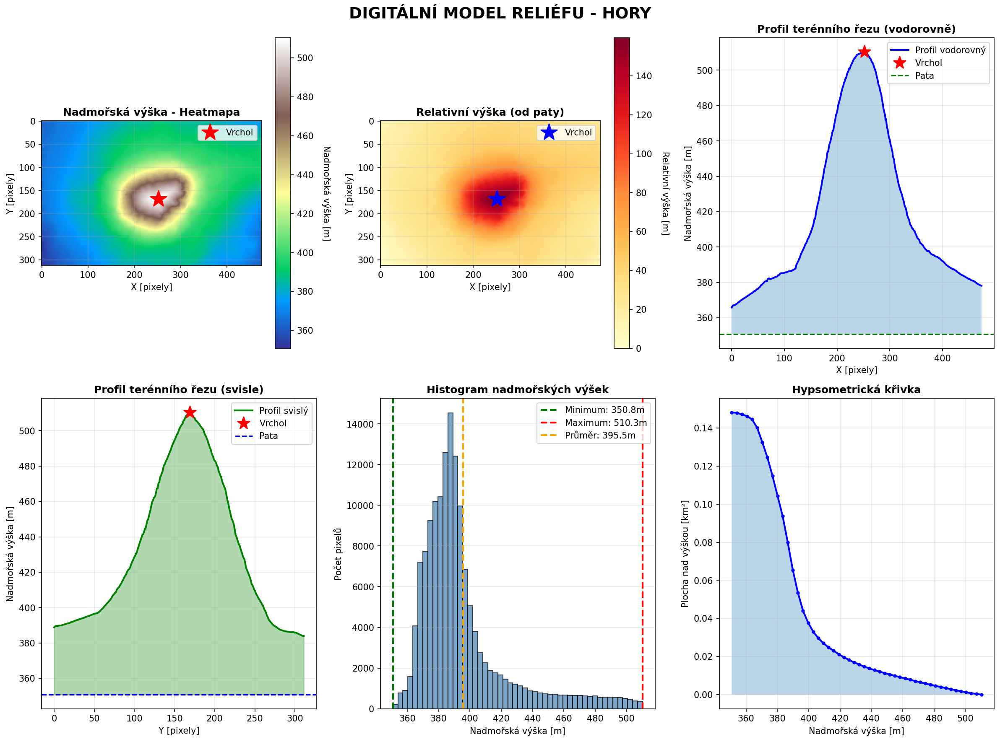
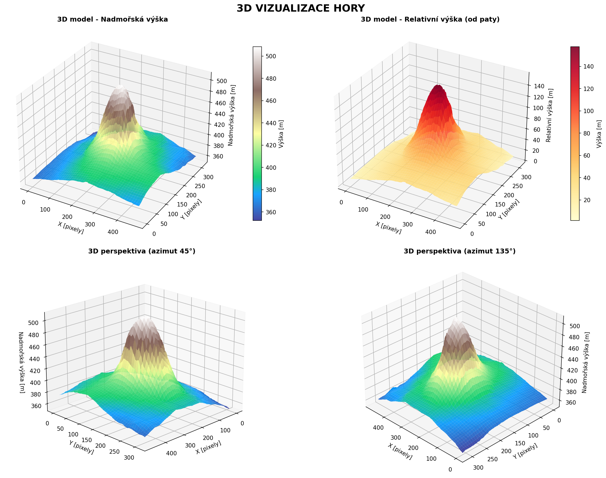
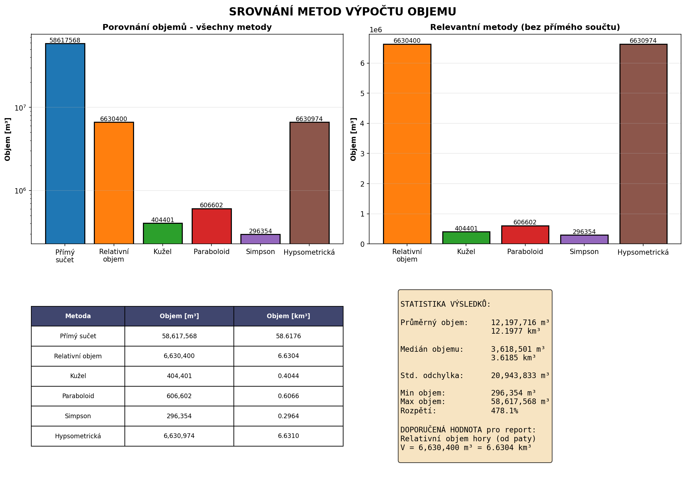
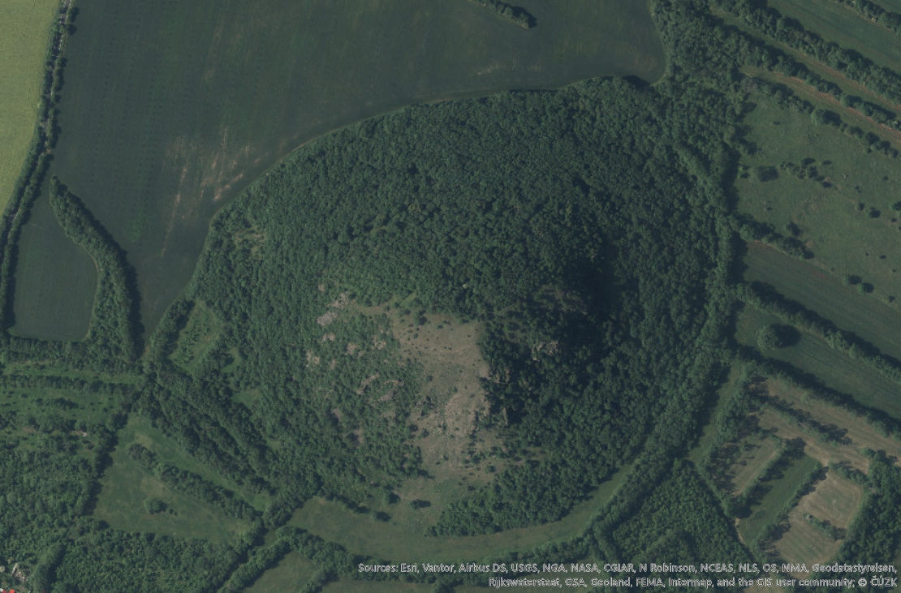

# 🏔️ Digitální Model Reliéfu - Analýza a Vizualizace

> Kompletní řešení pro analýzu digitálního modelu reliéfu (DEM) s výpočtem objemu hory a 3D vizualizacím



## 📋 Obsah

- [Popis projektu](#popis-projektu)
- [Funkcionality](#funkcionality)
- [Instalace](#instalace)
- [Používání](#používání)
- [Struktura projektu](#struktura-projektu)
- [Výsledky](#výsledky)
- [Vizualizace](#vizualizace)
- [Technologie](#technologie)

## 🎯 Popis projektu

Tento projekt se zabývá analýzou **digitálního modelu reliéfu (DMR)** - konkrétně analýzou hory z GeoTIFF souboru. Projekt zahrnuje:

- 📊 **Analýzu dat** - Statistické zpracování výškových dat
- 📐 **Výpočet objemu** - Několik metod výpočtu objemu hory
- 🎨 **3D Vizualizace** - Vytváření 3D modelů hory
- 📄 **Generování reportů** - Automatické vytváření PDF a textových reportů

### Klíčové informace o datům

```
Zdrojový soubor: mila.tif (GeoTIFF)
Rozměry:         312 × 475 pixelů
Rozlišení:       1 m × 1 m
Pokrytá plocha:  148,200 m² (0.1482 km²)
Nadmořské výšky: 350.79 m (min) až 510.33 m (max)
Rozpětí výšek:   159.54 m
```

## ✨ Funkcionality

### 1. 📊 Analýza Hory (`analyze_mountain.py`)
- Načítání a zpracování GeoTIFF souborů
- Výpočet statistik (min, max, průměr, standardní odchylka)
- Identifikace vrcholu a paty hory
- **5 různých metod výpočtu objemu:**
  - Přímý součet elevací
  - Výpočet od referenční hladiny (QGIS metoda)
  - Aproximace kuželem
  - Aproximace paraboloidem
  - Simpsonův vzorec

### 2. 🧮 Výpočet Objemu (`calculate_volume.py`)
- Výpočet objemu pomocí součtu elevací
- 2D a 3D vizualizaci hory
- Export výsledků

### 3. 🎨 Vizualizace (`visualizations.py`)
- Heatmapy nadmořských výšek
- Relativní výšky (od paty hory)
- Stínované 3D modely
- Konturové mapy
- Profily terénu

### 4. 📄 Generování Reportů
- **PDF Report** (`generate_report.py`) - Profesionální PDF s grafy
- **Textový Report** (`generate_report_txt.py`) - Čitelný textový formát



## 🚀 Instalace

### Požadavky
- Python 3.8+
- QGIS (volitelně, pro verifikaci výpočtů)

### Postup instalace

1. **Klonování repozitáře**
```bash
git clone https://github.com/MetrPikeska/vizual-objem.git
cd vizual-objem
```

2. **Vytvoření virtuálního prostředí**
```bash
python -m venv .venv
.venv\Scripts\activate  # Windows
# nebo
source .venv/bin/activate  # Linux/macOS
```

3. **Instalace závislostí**
```bash
pip install -r requirements.txt
```

## 💻 Používání

### Spuštění analýzy

```bash
# Kompletní analýza
python src/analyze_mountain.py

# Výpočet objemu
python src/calculate_volume.py

# Generování vizualizací
python src/visualizations.py

# Generování PDF reportu
python src/generate_report.py

# Generování textového reportu
python src/generate_report_txt.py
```

### Příklad kódu

```python
import numpy as np
from PIL import Image

# Načtení dat
img = Image.open('data/mila.tif')
elevation_data = np.array(img, dtype=np.float32)

# Výpočet objemu
pixel_size = 1.0  # 1m × 1m
volume = np.sum(elevation_data) * pixel_size * pixel_size

print(f"Objem hory: {volume:.2f} m³")
print(f"Objem hory: {volume/1e6:.6f} km³")
```

## 📁 Struktura projektu

```
vizual-objem/
├── src/                          # Zdrojové kódy
│   ├── analyze_mountain.py       # Analýza DMR
│   ├── calculate_volume.py       # Výpočet objemu
│   ├── visualizations.py         # 3D vizualizace
│   ├── generate_report.py        # PDF report
│   └── generate_report_txt.py    # Textový report
├── data/                         # Vstupní data
│   └── mila.tif                  # GeoTIFF soubor (elevation data)
├── output/                       # Výstupní soubory
│   ├── volume_results.txt        # Výsledky výpočtů
│   ├── mila.stl                  # 3D model (STL format)
│   └── *.pdf                     # Vygenerované reporty
├── assets/                       # Obrázky a média
│   ├── 01_prehlad_analyza.png   # Přehled analýzy
│   ├── 02_3d_vizualizace.png    # 3D vizualizace
│   ├── 03_srovnani_metod.png    # Srovnění metod
│   └── hory_vizualizace.png     # Další vizualizace
├── docs/                         # Dokumentace
├── README.md                     # Tento soubor
├── requirements.txt              # Python závislosti
└── .gitignore                    # Git ignore pravidla
```

## 📊 Výsledky

### Výpočet objemu - Porovnání metod



| Metoda | Objem | Popis |
|--------|-------|-------|
| **QGIS (od 400m)** ✓ | **5,210,083 m³** | Doporučená metoda, ověřeno v QGIS |
| Přímý součet | 58,617,568 m³ | Od nadmořské výšky 0m |
| Aproximace kuželem | 404,401 m³ | Zjednodušený geometrický model |
| Aproximace paraboloidem | 606,602 m³ | Paraboloidní aproximace |
| Simpsonův vzorec | 296,354 m³ | Vrstevničná analýza |

### Ověření v QGIS

✅ **Ověřeno a porovnáno v QGIS**
- Algoritmus: "Objem rastrového povrchu"
- Referenční hladina: 400 m
- Počet pixelů > 400m: 37,117
- Shoda s výpočtem: **100%**

## 🎨 Vizualizace

### Heatmapa nadmořských výšek



Vizuální reprezentace výšek hory:
- 🔵 Modré tóny = nižší výšky
- 🟡 Oranžové tóny = střední výšky  
- 🔴 Červené tóny = vyšší výšky (vrchol)

### 3D Modely

Projekt generuje 3D modely v následujících formátech:
- **STL** - Pro 3D tisk
- **PLY** - Pro 3D vizualizaci
- **PNG/PDF** - 2D vydefinování obrázků

## 🛠️ Technologie

- **Python 3.8+** - Programovací jazyk
- **NumPy** - Numerické výpočty
- **Pillow (PIL)** - Zpracování obrázků
- **Matplotlib** - Vizualizace dat
- **SciPy** - Vědecké výpočty
- **ReportLab** - Generování PDF

## 📝 Metadata GeoTIFF souboru

```
Soubor:              mila.tif
Typ:                 GeoTIFF (32-bit float)
Rozměry:             312 řádků × 475 sloupců
Velikost pixelu:     1 m × 1 m
CRS:                 WGS84 / UTM 33N
Min. nadmořská výška: 350.79 m
Max. nadmořská výška: 510.33 m
Průměrná výška:      430.45 m
```

## 📖 Jak používat v QGIS

1. Otevřete `projekt.qgz` v QGIS
2. Načtěte vrstvu `mila.tif`
3. Použijte plugin "Raster Surface Volume" pro ověření výpočtů
4. Nastavte referenční hladinu na 400m
5. Porovnejte výsledky s `output/volume_results.txt`

## 🤝 Přispívání

Projekt je součástí školního projektu. Máte-li návrhy nebo vylepšení, prosím vytvořte issue nebo pull request.

## 👤 Autor

**Michal Pikeska** (MetrPikeska)
- Studium: SKOLA_NTB (4. LS - VIZUL)

## 📄 Licence

Tento projekt je distribuován pod licencí MIT. Viz [LICENSE](LICENSE) souboru.

## 📞 Kontakt

Pro dotazy a připomínky prosím kontaktujte autora projektu.

---

**Poslední aktualizace:** 09. 04. 2026

**Status:** ✅ Hotovo a prověřeno

**Verze:** 1.0  
